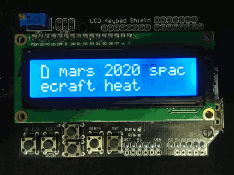

# Onion Omega2 Twitter pager

Little hack of mine showing recent tweets from selected news sources.
Up/down buttons change screen brightness and left/right scroll through tweets.

Components used:

* Onion Omega2+
* Onion Arduino Dock R2
* DFRobot LCD Keypad Shield

I assume that you have already configured your Omega to have internet connectivity. If not, start here: https://docs.onion.io/omega2-docs/first-time-setup.html

Install python and libraries to your Omega2:

    opkg update
    opkg install git git-http python python-pip pyOnionI2C
    pip install --upgrade pip
    pip install python-twitter
    opkg install arduino-dock-2

Paste your Twitter API keys and user ids that you wish to subscribe to config file:

    cp config.ini.example config.ini
    vim config.ini

You can get your API keys here: https://apps.twitter.com/
And convert twitter usernames to ids here: http://gettwitterid.com/

Upload python code to your Omega2:

    scp config.ini get_tweets.py run.sh root@omega-XXXX.local

Substitute XXXX to last digits of your Omega MAC address.

Upload Arduino sketch to your Onion Arduino Dock R2 as described here: https://docs.onion.io/omega2-docs/flash-arduino-dock-wirelessly.html

Then you can ssh to your Omega and run `./run.sh`. Script is working in streaming mode, so you'll have to wait until it gets some tweets. You can add `run.sh` to `/etc/rc.local` if you wish script to run on boot.

🤖🤘

